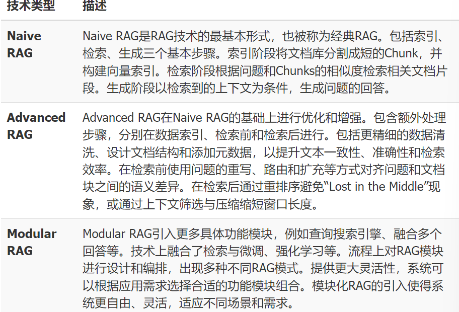
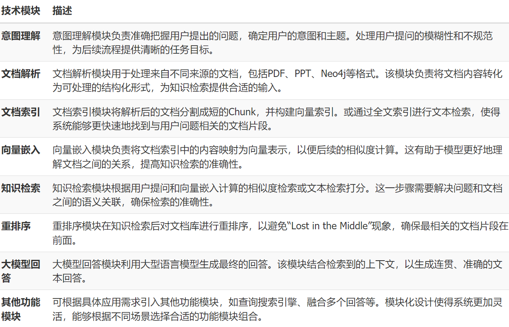

### RAG 介绍
RAG 是一种结合了检索和生成的技术，即结合大模型的生成能力和外部知识库的检索机制，让大模型在生成文本时利用额外的数据源，从而提升生成的质量和准确性。

### RAG的基本流程
- 首先，给定一个用户的输入，例如一个问题或一个话题，RAG会从一个数据源中检索出与之相关的文本片段，例如网页、文档或数据库记录。这些文本片段称为上下文（context）
- 其次，RAG将用户的输入和检索到的上下文拼接成一个完整的输入，传递给大模型
- 最后，RAG从大模型的输出中提取和格式化所需的信息，返回结果
### RAG 实现流程
使用RAG主要包括信息检索和大型语言模型调用两个关键过程。信息检索通过连接外部知识库，获取与问题相关的信息；而大模型调用则用于将这些信息整合到自然语言生成的过程中，以生成最终的回答。RAG可以细分为3个步骤，如下
- 问题理解：准备把握用户的意图，即如何将用户提问于知识库中的知识建立有效的关联
- 知识检索 用户提问可能以多种方式表达，而知识库的信息来源可能是多样的，包括PDF、PPT、Neo4j等格式。
- 答案生成

### RAG的类型(FROM RAG Survey)



### RAG技术板块



### LangChain

### LangChain Intro
LangChain:是一个开发语言模型应用的框架，主要是两个作用。第一个是上下文敏感(能够帮助LM连接外部知识，各种上下文资源)，第二个是依赖LM去推理，生成回答。 

#### Retrieval Chain
```python
import os
from langchain_openai import ChatOpenAI

# initialize the LLM 
open_api_key = os.getenv("OPENAI_API_KEY")
llm = ChatOpenAI(openai_api_key=open_api_key)

from langchain_community.document_loaders import WebBaseLoader
loader = WebBaseLoader("https://docs.smith.langchain.com/overview")

docs = loader.load()

# index it into a vectorstore -- embedding model vectorstore

from langchain_openai import OpenAIEmbeddings

embeddings = OpenAIEmbeddings()

from langchain_community.vectorstores import FAISS
from langchain.text_splitter import RecursiveCharacterTextSplitter


text_splitter = RecursiveCharacterTextSplitter()
documents = text_splitter.split_documents(docs)
vector = FAISS.from_documents(documents, embeddings)

# Create a retrieved chain
from langchain.chains.combine_documents import create_stuff_documents_chain

prompt = ChatPromptTemplate.from_template("""Answer the following question based only on the provided context:

<context>
{context}
</context>

Question: {input}""")

document_chain = create_stuff_documents_chain(llm, prompt)

from langchain_core.documents import Document

document_chain.invoke({
    "input": "how can langsmith help with testing?",
    "context": [Document(page_content="langsmith can let you visualize test results")]
})

```
#### [RAG in LangChain](https://python.langchain.com/docs/expression_language/cookbook/retrieval)

